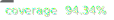

# Accessibility Audit CLI
[](https://www.npmjs.com/package/@consevangelou/accessibility-audit-cli)

[](https://github.com/gieglas/accessibility-audit-cli/actions/workflows/unit-test.yml)
[](https://github.com/gieglas/accessibility-audit-cli/actions/workflows/tag-and-publish-on-version-change.yml)
[](coverage-summary.json)

This project is a CLI tool used to run bulk accessibility audits (WCAG / EN 301 549) and do aggregated analysis.
- **Audits** are built on top of **Puppeteer** and **axe-core**, designed to run repeatable, standards-aligned accessibility audits.
- **Aggregated analysis** is performed over accessibility audit results generated by the audits

It is designed to support **government-scale monitoring** of accessibility compliance, aligned with **EN 301 549 / WCAG**, and to reproduce metrics required for **EU accessibility reporting**.

> ⚠️ **Warning:**  
> **What this tool does NOT do:**
> 
> - It does not certify accessibility compliance
> - It does not replace manual audits
> - It does not produce legal conformance statements

The outputs of this tool are **evidence inputs** for accessibility monitoring and must be interpreted within an appropriate legal and methodological framework.

A typical workflow using this tool is:

[🧪 Audit](#audit) → [📊 Analysis](#analysis) → [📉 Excel analysis](#excel-aggregated-analysis-template)

## Table of Contents

- [📋 Requirements](#requirements)
- [📦 Installation](#installation)
- [🛠️ Usage](#usage)
  - [🧪 Audit](#audit)
  - [📊 Analysis](#analysis)
    - [📉 Excel aggregated analysis template](#excel-aggregated-analysis-template)
- [⚖️ Compliance and Standards](#compliance-and-standards)
- [📝 Notes](#notes)
- [📄 License](#license)

<span id="requirements"></span>
## 📋 Requirements

- Node.js v20+
- npm
- Local execution (some sites block cloud runners)

<span id="installation"></span>
## 📦 Installation

```bash
npm install @consevangelou/accessibility-audit-cli
```

<span id="usage"></span>
## 🛠️ Usage

<span id="audit"></span>
### 🧪 Audit

The audit command does the following:
- Loads an audit configuration JSON
- Audits pages using Puppeteer + axe-core
- Produces:
  - Raw findings (direct tool output)
  - Normalised findings (grouped, standards-aligned)
- Persists each audit run as a JSON file

Run the `accessibility-audit` command with a path to an audit config file.

```bash
npx accessibility-audit audit audit-config.json
```

or

```bash
.\node_modules\.bin\accessibility-audit audit audit-config.json
```

#### Debug and logging mode

Add `--debug` to enable debug mode and `--log` to enable logging to file.

```bash
npx accessibility-audit audit audit-config.json --debug --log
```

**Notes**

- Debug mode captures screenshots and rendered HTML in `/debug`.
- Logs mirror CLI output into a timestamped file under `./log/` by passing `--log`.
  - Each run creates `log/audit-run-YYYYMMDDHHMMSS.txt` containing the same lines shown in the console, prefixed with `ISO_TIMESTAMP LEVEL` for easier parsing.

#### Audit config example

The audit config file is a JSON object that specifies the sites, pages and standards to audit. It has the following structure:

```json
{
    "standard": "EN301549-v3.2.1",
    "sites": [
        {
            "siteId": "govcy",
            "baseUrl": "https://www.gov.cy",
            "pages": [
                {
                    "pageId": "home",
                    "url": "https://www.gov.cy/"
                },
                {
                    "pageId": "search",
                    "url": "https://www.gov.cy/?s=performance"
                }
            ]
        },
        {
            "siteId": "consevangelou",
            "baseUrl": "https://consevangelou.com/",
            "pages": [
                {
                    "pageId": "home",
                    "url": "https://consevangelou.com/"
                },
                {
                    "pageId": "search",
                    "url": "https://consevangelou.com/search/"
                }
            ]
        }
    ]
}
```

Note: `baseUrl` is currently informational and not used during execution.

#### Audit Output

- Running an audit produces **persistent audit result files** on disk.
  Each audit run generates **one JSON file per site**, containing:

  - Metadata about the audit run
  - The scope of pages audited
  - Raw findings from axe-core
  - Normalised findings grouped for reporting and aggregation

  These files are designed to be:

  - Immutable (never modified after creation)
  - Easy to aggregate later (per site, per period, per standard)
  - Independent of reporting or visualisation logic

#### Audit output files and folder structure

Audit results are stored under the `audits/` directory using a **standard-first, site-centric structure**.

Current structure:

```text
audits/
└── EN301549_v3.2.1/
    └── site-govcy/
        ├── run-20251229.json
        ├── run-20251230.json
```

**Explanation:**

- `EN301549_v3.2.1/`
  The reference standard used for the audit.
  This allows future audits against newer standards to coexist safely.
- `site-govcy/`
  One folder per audited site (`siteId` from the audit config).
- `run-YYYYMMDD.json`
  One file per audit execution, named using the UTC date of the run.
  This makes time-based aggregation trivial without opening files.

Each file represents **one audit run for one site**.

------

#### Audit Output schema (high-level)

Each audit run file follows this structure:

```
{
  schemaVersion,
  auditRun,
  environment,
  standard,
  scope,
  results
}
```

At a glance:

- `auditRun` → when and how long the audit ran
- `environment` → tooling context (axe-core, Node version)
- `standard` → accessibility standard used
- `scope` → site and pages audited
- `results` → findings (raw + normalised)

------

#### Audit Output schema (detailed)

Below is the full logical schema, with key fields explained.

##### Root

```yml
schemaVersion: string
auditRun: AuditRunMeta
environment: EnvironmentMeta
standard: StandardMeta
scope: AuditScope
results: AuditResults
```

------

##### AuditRunMeta

```yaml
auditRun: {
  auditRunId: string,
  startedAt: ISODateString,
  finishedAt: ISODateString,
  durationMs: number
}
```

- `auditRunId`
  Unique identifier for this run.
- `startedAt`, `finishedAt`
  ISO timestamps in UTC.
- `durationMs`
  Total execution time for this site.

------

##### EnvironmentMeta

```yaml
environment: {
  tool: "axe-core",
  nodeVersion: string
}
```

Describes the runtime environment that produced the audit.

------

##### StandardMeta

```yaml
standard: {
  standardId: string,
  wcagVersion: string
}
```

References the standard JSON used to interpret WCAG criteria.

------

##### AuditScope

```yaml
scope: {
  siteId: string,
  pages: [
    {
      pageId: string,
      url: string
    }
  ]
}
```

Defines **what was audited**, not what was found.

------

##### AuditResults

```yaml
results: {
  rawFindings: RawFinding[],
  normalisedFindings: {
    compliance: NormalisedFinding[],
    other: NormalisedFinding[]
  }
}
```

Two layers are intentionally preserved:

- `rawFindings`
  Tool-level, unfiltered output from axe-core.
- `normalisedFindings`
  Grouped, classified, reporting-ready findings.

------

##### RawFinding

A RawFinding represents **one axe-core violation on one DOM node**.

```c#
{
  rawFindingId: string,
  auditRunId: string,
  siteId: string,
  pageId: string,
  pageUrl: string,

  source: "cli",
  tool: "axe-core",
  timestamp: ISODateString,

  ruleId: string,
  message: string,
  selector: string,

  wcagTags: string[],
  impact: "minor" | "moderate" | "serious" | "critical",

  findingType: "violation"
}
```

Raw findings are **never aggregated or altered**.

------

##### NormalisedFinding

Normalised findings are **grouped summaries** suitable for compliance reporting.

```c#
{
  auditRunId: string,
  siteId: string,
  pageId: string,
  pageUrl: string,

  wcagCriterionId: string | null,
  ruleId: string | null,

  classification: "automated-violation",
  severity: "low" | "medium" | "high" | "critical",

  occurrenceCount: number,
  sourceRawFindingIds: string[]
}
```

Grouping rules:

- If a WCAG criterion is resolved → grouped under `compliance`
- If no WCAG criterion is resolved → grouped under `other`

This separation ensures:

- Conservative compliance reporting
- Non-WCAG best-practice issues remain visible but distinct

------

#### Audit Example output (excerpt)

```json
{
  "schemaVersion": "1.0",
  "auditRun": {
    "auditRunId": "run-1767115568791",
    "startedAt": "2025-12-30T17:26:08.791Z",
    "finishedAt": "2025-12-30T17:26:18.454Z",
    "durationMs": 9663
  },
  "environment": {
    "tool": "axe-core",
    "nodeVersion": "v22.20.0"
  },
  "standard": {
    "standardId": "EN301549_v3.2.1",
    "wcagVersion": "2.1"
  },
  "scope": {
    "siteId": "govcy",
    "pages": [
      {
        "pageId": "home",
        "url": "https://www.gov.cy/"
      },
      {
        "pageId": "search",
        "url": "https://www.gov.cy/?s=performance"
      }
    ]
  },
  "results": {
    "rawFindings": [
      {
        "rawFindingId": "6c04cb29-580f-49f7-9a7d-6402c97e8a17",
        "auditRunId": "run-1767115568791",
        "siteId": "govcy",
        "pageId": "home",
        "pageUrl": "https://www.gov.cy/",
        "source": "cli",
        "tool": "axe-core",
        "timestamp": "2025-12-30T17:26:13.218Z",
        "ruleId": "landmark-main-is-top-level",
        "message": "Ensure the main landmark is at top level",
        "selector": "#webchat",
        "wcagTags": [
          "cat.semantics",
          "best-practice"
        ],
        "impact": "moderate",
        "findingType": "violation"
      },
      {
        "rawFindingId": "8f79304d-ddb4-4575-aaf3-6af1a6d4d05a",
        "auditRunId": "run-1767115568791",
        "siteId": "govcy",
        "pageId": "search",
        "pageUrl": "https://www.gov.cy/?s=performance",
        "source": "cli",
        "tool": "axe-core",
        "timestamp": "2025-12-30T17:26:18.442Z",
        "ruleId": "label",
        "message": "Ensure every form element has a label",
        "selector": "#service-type-filter",
        "wcagTags": [
          "cat.forms",
          "wcag2a",
          "wcag412",
          "section508",
          "section508.22.n",
          "TTv5",
          "TT5.c",
          "EN-301-549",
          "EN-9.4.1.2",
          "ACT",
          "RGAAv4",
          "RGAA-11.1.1"
        ],
        "impact": "critical",
        "findingType": "violation"
      }
    ],
    "normalisedFindings": {
      "compliance": [
        {
          "auditRunId": "run-1767115568791",
          "siteId": "govcy",
          "pageId": "search",
          "pageUrl": "https://www.gov.cy/?s=performance",
          "wcagCriterionId": "4.1.2",
          "ruleId": null,
          "classification": "automated-violation",
          "severity": "critical",
          "occurrenceCount": 1,
          "sourceRawFindingIds": [
            "8f79304d-ddb4-4575-aaf3-6af1a6d4d05a"
          ]
        }
      ],
      "other": [
        {
          "auditRunId": "run-1767115568791",
          "siteId": "govcy",
          "pageId": "home",
          "pageUrl": "https://www.gov.cy/",
          "wcagCriterionId": null,
          "ruleId": "landmark-main-is-top-level",
          "classification": "automated-violation",
          "severity": "medium",
          "occurrenceCount": 1,
          "sourceRawFindingIds": [
            "6c04cb29-580f-49f7-9a7d-6402c97e8a17"
          ]
        }
      ]
    }
  }
}
```

<span id="analysis"></span>
### 📊 Analysis

The analysis commands help you **work with existing audit results**.
They do not run new audits and do not modify audit data.

All analysis commands operate on files in the current working directory.

The analysis command does the following:
- Loads accessibility audit result files (JSON)
- Aggregates **WCAG compliance violations**
- Produces structured analysis output (JSON, CSV)
- Currently implemented aggregation:
    - **Violations by WCAG tree**

The analysis command is **config-driven by default**, with optional CLI flags to override specific settings.

```bash
npx accessibility-audit analysis run --config analysis-config.json
```

Overwrite specific options if needed

```bash
npx accessibility-audit analysis run \
  --config analysis.config.json \
  --mode all \
  --audits ./audits/EN301549_v3.2.1
```

#### Analysis configuration file
Example `analysis-config.json`

```json
{
  "auditsPath": "./audits/EN301549_v3.2.1",
  "standard": "EN301549-v3.2.1",
  "mode": "latest",
  "output": {
    "directory": "./analysis-output",
    "filenamePrefix": "cyprus-accessibility-analysis",
    "formats": ["json"]
  }
}

```

#### Analysis configuration fields

| Field                   | Description                                     | Required                        |
| ----------------------- | ----------------------------------------------- | ------------------------------- |
| `auditsPath`            | Root directory containing audit results         | ✅                               |
| `standard`              | Accessibility standard ID                       | ❌ (defaults to EN301549-v3.2.1) |
| `mode`                  | `latest` (one run per site) or `all` (all runs) | ❌ (default: `latest`)           |
| `output.directory`      | Directory where analysis files are written      | ❌                               |
| `output.filenamePrefix` | Output filename prefix                          | ❌                               |
| `output.formats`        | Output formats (`json`, future: `csv`, `xlsx`)  | ❌                               |

#### Analysis configuration modes

The CLI supports two analysis modes:
##### `latest` (default, recommended)
- Uses **only the most recent audit run per site**
- Avoids double-counting identical violations across days
- Best for:
    - EU reporting
    - Government-wide snapshots
    - Compliance overviews

##### `all`
- Uses **all audit runs**
- Aggregates violations across time
- Best for:
    - Trend analysis
    - Progress tracking
    - Regression analysis

#### Analysis input: Audit results

This tool expects audit files produced by `audit` command. 

Expected folder structure:

```text
audits/
└── EN301549_v3.2.1/
    ├── site-govcy/
    │   ├── run-20251229.json
    │   ├── run-20251230.json
    ├── site-other/
    │   ├── run-20251229.json

```
Each file must follow the **audit-run schema** (including `schemaVersion`, `auditRun`, and `results.normalisedFindings`).

#### Analysis output

By default, the analysis produces a timestamped JSON file and optionally a CSV file:

```
analysis-output/
└── cyprus-accessibility-analysis-YYYYMMDD.json
└── cyprus-accessibility-analysis-YYYYMMDD.csv
```

Example JSON:

```json
{
  "generatedAt": "2026-02-06T16:29:48.159Z",
  "standard": {
    "standardId": "EN301549_v3.2.1",
    "wcagVersion": "2.1"
  },
  "mode": "latest",
  "source": {
    "auditsPath": "C:\\Users\\constantinos\\Documents\\code\\DSF\\ce-accessibility-audit-cli\\audits"
  },
  "aggregations": {
    "violationsByWcagTree": {
      "totalViolations": 75,
      "tree": {
        "Understandable": {
          "total": 4,
          "guidelines": {
            "3.1": {
              "total": 4,
              "criteria": {
                "3.1.1": 4
              }
            }
          }
        },
        "Robust": {
          "total": 11,
          "guidelines": {
            "4.1": {
              "total": 11,
              "criteria": {
                "4.1.2": 11
              }
            }
          }
        },
        "Perceivable": {
          "total": 56,
          "guidelines": {
            "1.4": {
              "total": 49,
              "criteria": {
                "1.4.3": 42,
                "1.4.1": 7
              }
            },
            "1.1": {
              "total": 7,
              "criteria": {
                "1.1.1": 7
              }
            }
          }
        },
        "Operable": {
          "total": 4,
          "guidelines": {
            "2.1": {
              "total": 3,
              "criteria": {
                "2.1.1": 3
              }
            },
            "2.4": {
              "total": 1,
              "criteria": {
                "2.4.4": 1
              }
            }
          }
        }
      }
    }
  },
  "sites": [
    {
      "siteId": "consevangelou",
      "violations": {
        "compliance": 0,
        "other": 0
      }
    },
    {
      "siteId": "cypruspost",
      "violations": {
        "compliance": 46,
        "other": 7
      }
    },
    {
      "siteId": "dsf",
      "violations": {
        "compliance": 0,
        "other": 4
      }
    },
    {
      "siteId": "govcy",
      "violations": {
        "compliance": 2,
        "other": 11
      }
    },
    {
      "siteId": "idme",
      "violations": {
        "compliance": 8,
        "other": 3
      }
    },
    {
      "siteId": "kep-kepo",
      "violations": {
        "compliance": 16,
        "other": 63
      }
    },
    {
      "siteId": "presidency",
      "violations": {
        "compliance": 3,
        "other": 7
      }
    }
  ]
}

```

Example CSV:

```csv
principle,guidelineId,criterionId,occurrences
Robust,4.1,4.1.2,4
Perceivable,1.1,1.1.1,1
Perceivable,1.4,1.4.3,7
Operable,2.4,2.4.4,1
```

This output is designed to be:

- Imported into Excel / CSV pipelines
- Compared against official EU reports
- Used as input for dashboards

<span id="excel-aggregated-analysis-template"></span>
#### 📉 Excel aggregated analysis template

Two Excel workbooks are available for quick charting and reporting:

- **Aggregated analysis**: `excel_analysis/aggregated_analysis/aggregated-analysis-template.xlsx` This is used to generate aggregated reports and dashboards for EU reporting purposes based on the analysis CSV output
- **Site analysis**: `excel_analysis/audit-analysis/audit-analysis-template.xlsx` This is used to generate site-specific reports and dashboards based on a single audit run JSON

##### Excel: Initialise
The package has an **Initialise Excel analysis files** helper command.

It creates a local Excel analysis workspace by copying the official Excel template and related files into your project directory.

```bash
npx accessibility-audit analysis init-excel
```

This command:
- Copies Excel templates from the package into your project
- Creates the following structure if it does not exist:

```
excel_analysis/
└── aggregated_analysis/
    └── aggregated-analysis-template.xlsm
└── audit_analysis/
    └── audit-analysis-template.xlsm
```

##### Excel: Aggregated analysis

- Template: `excel_analysis/aggregated_analysis/aggregated-analysis-template.xlsx`
- Sample data file: `excel_analysis/aggregated_analysis/aggregated-analysis.json`
- Hit the **Load Analysis JSON** button to choose the JSON file to be loaded and update the connection. The JSON is expected to have the same structure as the one generated by the `analysis` command. 
- After updating the connection, hit **Refresh** button to sync the PivotTables / charts with the new data

##### Excel: Site analysis

- Template: `excel_analysis/audit_analysis/audit-analysis-template.xlsx`
- Sample data file: `excel_analysis/audit_analysis/audit-analysis.json` (JSON file generated by the `analysis` command)
- Hit the **Load Site's audit JSON File** button to choose the JSON file to be loaded and update the connection. The JSON is expected to be generated by the `audit` command
- After updating the connection, hit **Refresh** button to sync the PivotTables / charts with the new data

<span id="compliance-and-standards"></span>
## ⚖️ Compliance and Standards

### Compliance philosophy

This tool follows a **conservative, standards-first approach** to accessibility compliance.

- Automated tools are treated as **evidence generators**, not compliance arbiters
- A finding only affects compliance if it:
  - maps to a WCAG Success Criterion, **and**
  - exists in the selected EN 301 549 reference standard

This avoids:

- overstating compliance
- inflating non-normative issues
- producing results that cannot be defended in audits or legal contexts

As a result, compliance outputs are:

- **traceable** (each finding maps to a criterion)
- **repeatable** (same input → same output)
- **explainable** to auditors, service owners, and the public

Best-practice findings are preserved separately to support improvement, without distorting compliance results.

------

### Why “compliance” is treated explicitly

This project makes a **clear distinction** between:

- **Accessibility findings** (what tools detect)
- **Legal / standards compliance** (what the law and EN 301 549 require)

Not every accessibility issue detected by automated tools:

- maps cleanly to WCAG Success Criteria
- is legally enforceable
- should affect compliance statistics

For this reason, **compliance is not inferred implicitly** — it is **explicitly resolved** using a reference standard.

------

### How compliance is determined

Compliance is determined during **normalisation**, not during scanning.

Flow:

1. Tools (axe-core) produce **RawFindings**
2. Raw findings contain:
   - rule IDs
   - WCAG tags (when available)
3. Each finding is resolved against the reference standard:
   - If a WCAG criterion exists in the standard → **compliance**
   - If not → **other (non-compliance)**

This logic ensures:

- Compliance results are **defensible**
- Best-practice issues remain visible but do not pollute compliance metrics
- Reporting remains aligned with EN 301 549 and monitoring requirements

------

### `normalisedFindings.compliance` vs `normalisedFindings.other`

Normalised findings are split into two explicit groups:

```
normalisedFindings: {
  compliance: [...],
  other: [...]
}
```

#### `compliance`

Contains only findings that:

- Map to a WCAG Success Criterion
- Exist in the selected reference standard
- Are eligible for legal / regulatory reporting

These findings are intended for:

- Monitoring reports
- Compliance dashboards
- KPIs and trend analysis

#### `other`

Contains findings that:

- Are best-practice
- Are informative but non-normative
- Do not map to a WCAG criterion in the standard

These findings are intended for:

- Implementation teams
- Debugging
- Quality improvement

They are **explicitly excluded** from compliance statistics.

------

### Why standards are externalised

Accessibility standards are **not stored in this repository**.

They are stored separately (included in the `@consevangelou/accessibility-audit-core` package) because:

- EN 301 549 versions change
- WCAG versions evolve
- Reporting rules may differ by jurisdiction

By externalising standards:

- The same audit engine can be reused
- Historical audits remain valid
- Aggregation can be standard-aware in the future

This also enables future support for:

- EN 301 549 v4.x
- WCAG 2.2 / 3.0
- National monitoring variants

------

### Design principle

> **Tools detect issues.
> Standards decide compliance.**

This separation is intentional, conservative, and aligned with official accessibility monitoring practices.

<span id="notes"></span>
## 📝 Notes

- Empty arrays are always returned if no findings exist.
- Compliance findings are strictly WCAG-mapped.

<span id="license"></span>
## 📄 License

MIT © 2026 Constantinos Evangelou
